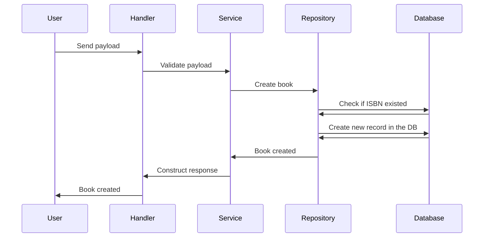

# ISBN Book API

This is a simple API to manage books using their ISBN numbers. It allows you to add, retrieve, and delete books from a collection.

## How to run locally
Run the following command to start the API locally:

```bash
make dev
```

## How to run with Docker
To run the API using Docker, use the following command:

```bash
docker build -t isbn-book-api .
docker run -p 8080:8080 isbn-book-api
```

## How to test
To run the tests, use the following command:

```bash
make test
```

## API Endpoints
### Create a book



This endpoint allows you to create a new book entry. This endpoint expects a JSON body with the book's details. The request payload will be validated, and if successful, the book will be added to the collection.

POST `/books`
```json
{
  "isbn": "1234567890123",
  "title": "Example Book",
  "author": "John Doe",
  "release_date": "2023-10-01"
}
```
### Response
```json
{
    "isbn": "1234567890123",
    "title": "Example Book",
    "author": "John Doe",
    "release_date": "2023-10-01"
}
```

### Get book by ISBN

### Get list of books

### Update a book by ISBN

### Delete a book by ISBN