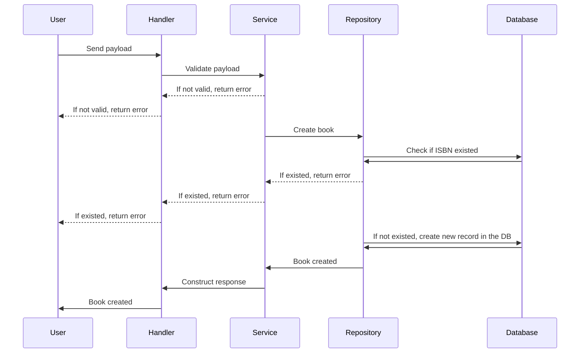
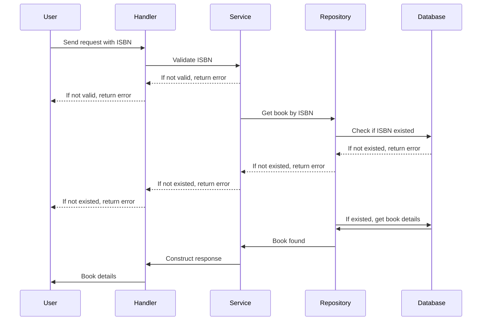
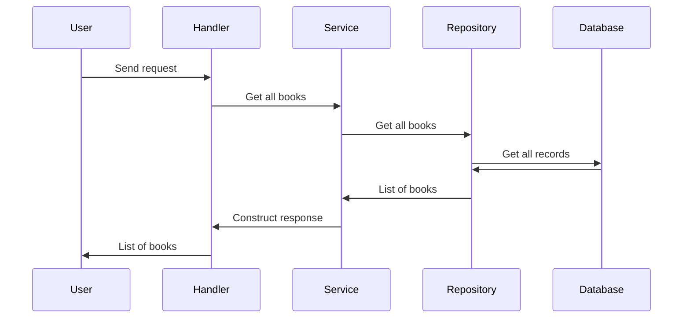
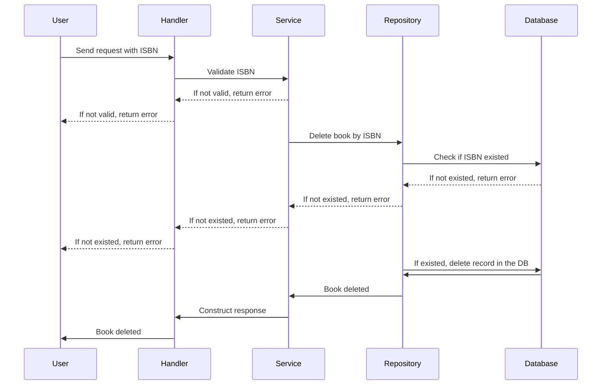
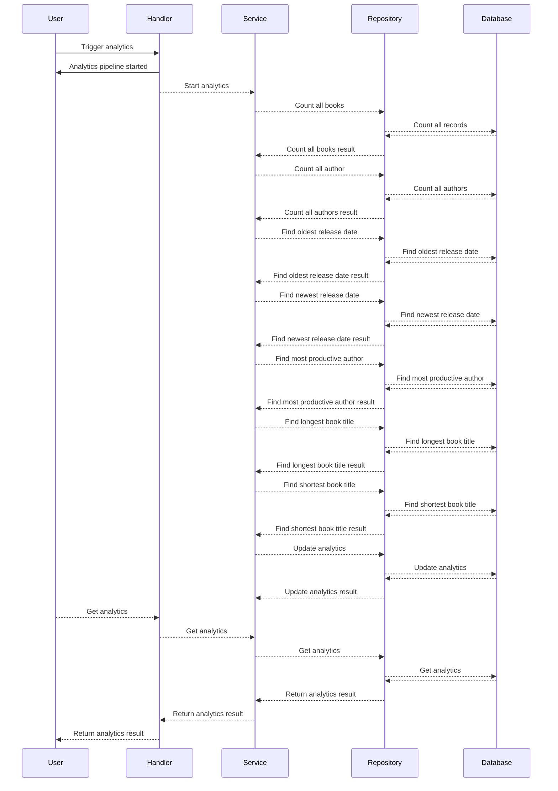

# ISBN Book API

This is a simple API to manage books using their ISBN numbers. It allows you to add, retrieve, and delete books from a collection. It will log all requests and responses to a file (app.log) and stdout.

## Table of Contents
- [How to run locally](#how-to-run-locally)
- [How to run with Docker](#how-to-run-with-docker)
- [How to test](#how-to-test)
- [API Endpoints](#api-endpoints)
  - [Create a book](#create-a-book)
  - [Get book by ISBN](#get-book-by-isbn)
  - [Get list of books](#get-list-of-books)
  - [Update a book by ISBN](#update-a-book-by-isbn)
  - [Delete a book by ISBN](#delete-a-book-by-isbn)
  - [Analytics Endpoints](#analytics-endpoints)

## How to run locally
Run the following command to start the API locally:

```bash
make dev
```

## How to run with Docker
To run the API using Docker, use the following command:

```bash
docker build -t isbn-book-api .
docker run -p 8080:8080 isbn-book-api
```

## How to test
To run the tests, use the following command:

```bash
make test
```

You can also run the tests with actual API calls using the command below. But make sure to have the API running locally or in Docker.

```bash
make test_curl
```

## API Endpoints
### Create a book



This endpoint allows you to create a new book entry. This endpoint expects a JSON body with the book's details. The request payload will be validated, and if successful, the book will be added to the collection.

POST `/books`

```json
{
  "isbn": "1234567890123",
  "title": "Example Book",
  "author": "John Doe",
  "release_date": "2023-10-01"
}
```
#### Response
```json
{
    "isbn": "1234567890123",
    "title": "Example Book",
    "author": "John Doe",
    "release_date": "2023-10-01"
}
```

### Get book by ISBN

This endpoint allows you to retrieve a book's details using its ISBN. If the book exists, its details will be returned.

GET `/books/{isbn}`

#### Response
```json
{
    "isbn": "1234567890123",
    "title": "Example Book",
    "author": "John Doe",
    "release_date": "2023-10-01"
}
```
 
### Get list of books

This endpoint allows you to retrieve a list of all books in the collection. The response will include all book details. You can also paginate the results by providing `page` and `limit` query parameters.

GET `/books?page={page}&limit={limit}`

#### Response
```json
{
    "data": [
        {
            "isbn": "1234567890123",
            "title": "Example Book",
            "author": "John Doe",
            "release_date": "2023-10-01"
        },
        {
            "isbn": "9876543210987",
            "title": "Another Book",
            "author": "Jane Smith",
            "release_date": "2023-09-15"
        }
    ],
    "total": 2,
    "total_pages": 1,
    "page": 1,
    "limit": 10
}
```


### Update a book by ISBN


This endpoint allows you to update the details of an existing book using its ISBN. The request payload should include the updated book details.


PUT `/books/{isbn}`

```json
{
  "title": "Updated Book Title",
  "author": "Updated Author",
  "release_date": "2023-11-01"
}
```
#### Response
```json
{
    "isbn": "1234567890123",
    "title": "Updated Book Title",
    "author": "Updated Author",
    "release_date": "2023-11-01"
}
```

### Delete a book by ISBN

This endpoint allows you to delete a book from the collection using its ISBN. If the book exists, it will be removed from the collection.

DELETE `/books/{isbn}`

#### Response
```json
{
    "message": "Book deleted successfully"
}
```

### Analytics Endpoints
To simulate the usage of goroutines, I added two endpoints to trigger the analytics process. These endpoints will run in the background and will not block the main thread. The analytics handler will trigger the analytics service, which will perform the analytics tasks concurrently using goroutines. Inside this service, multiple goroutines will be used to perform different analytics tasks, such as counting books, finding the oldest and newest release dates, and identifying the most productive author. The results of these tasks will be collected and stored in the database. After the analytics process is complete, the user can retrieve the analytics results using get analytics endpoint.


